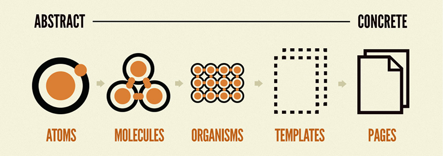

# Introduction

This is a React app created using `create react app` and is used for tracking the users bank account. The name of the app is "ArgentBank".
It uses the following technologies:

- Redux for global state management
- Axios for communicating with the backend
- The authentication is based on tokens (JWT)
- PropTypes for prop checking

## Installation

1. Clone this repo on your computer
2. install its dependencies run `npm install`
3. Download and install the API for the backend [BACKEND FOR THIS PROJECT](https://github.com/OpenClassrooms-Student-Center/Project-10-Bank-API) - follow the instructions top run the API locally
4. You should be able to log in with one of the accounts provided on the API repo

## Folder Structure

This project follows the [Atomic Design Methodology](https://atomicdesign.bradfrost.com/chapter-2/)



    .
    ├── public                      # Public folder
    ├── src                         # Redux Store inside
        ├── app                     # Redux Store inside
        ├── assets                  # Images and css files
        ├── components              # Tools and utilities
            ├── layouts             # Tools and utilities
            ├── UI                  # UI components
                ├── atoms           # Minimal UI part (input, button, label, etc)
                ├── molecules       # Small group of atoms
                ├── organisms       # Parts of pages (Cards, Hero, Error modal, etc)
        ├── features                # Redux slices
        ├── mockup                  # Mock data as examples for next stages of the API
        ├── pages                   # App pages handled with react-router
        ├── utils                   # formatting helper functions (currency and data)
    └── README.md

## Authentication
The `/login` page requires a username and a password. If they are correct the user will be redirected to the protected route `/user`. A token will be stored in the browser's Session Storage. This JWT contains no sensitive information. It carries the user's id, the date of emition and expipre date of the encoded in the token. 

## Redux Integration
The user's intial state is 
```javascript
const initialState = {
	isLoading: false,
	error: null,
	data: null,
	transactions: null,
}
```
Redux will use an async action from the Redux Toolkit ( createAsyncThunk )
There are three possible states for this action:
- pending (sets loading to true)
- fulfilled (sets the user's data)
- rejected (set the error to true)

When the user log out the action `destroyUserData` will be dispatched and the data will be deleted from the Redux store and the token will be deleted from the browser's Session Storage.

## Available Scripts

In the project directory, you can run:

### `npm start`

Runs the app in the development mode.\
Open [http://localhost:3000](http://localhost:3000) to view it in your browser.

The page will reload when you make changes.\
You may also see any lint errors in the console.


### `npm run build`

Builds the app for production to the `build` folder.\
It correctly bundles React in production mode and optimizes the build for the best performance.

The build is minified and the filenames include the hashes.\
Your app is ready to be deployed!

See the section about [deployment](https://facebook.github.io/create-react-app/docs/deployment) for more information.